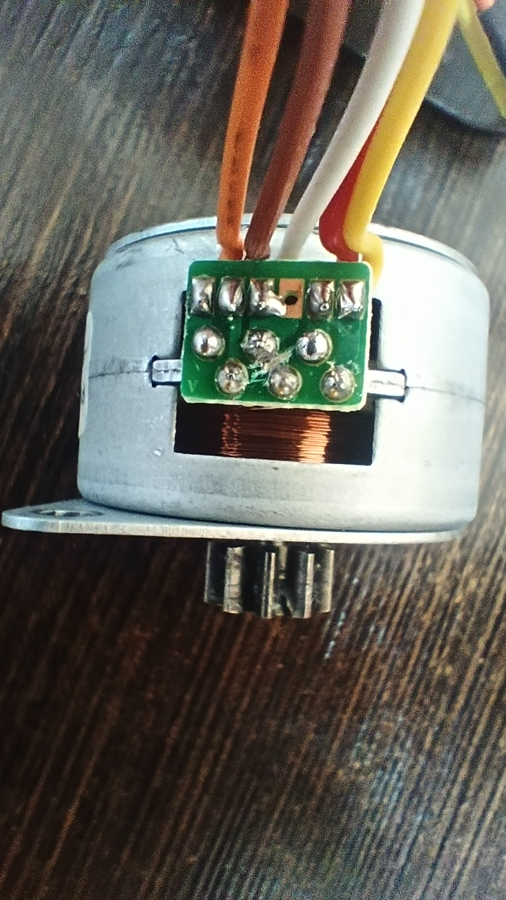
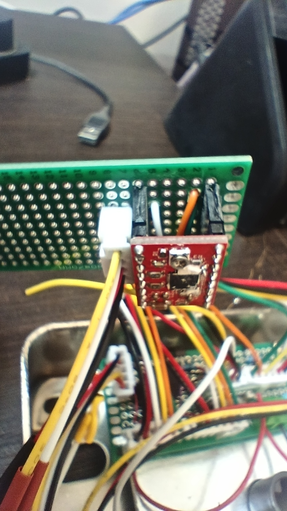
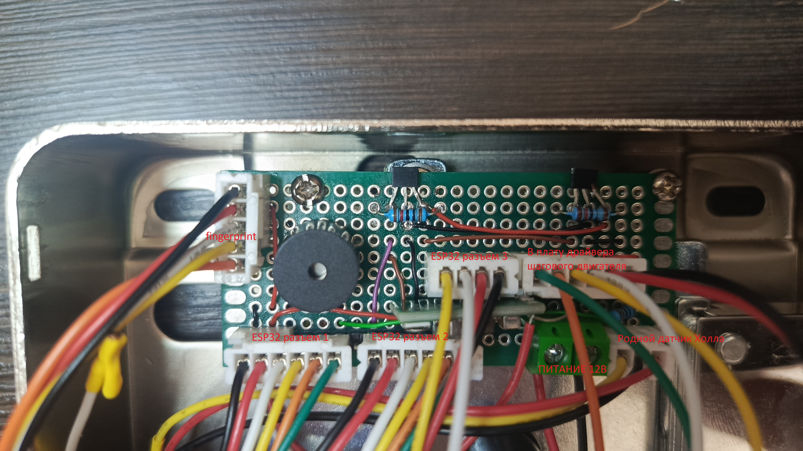
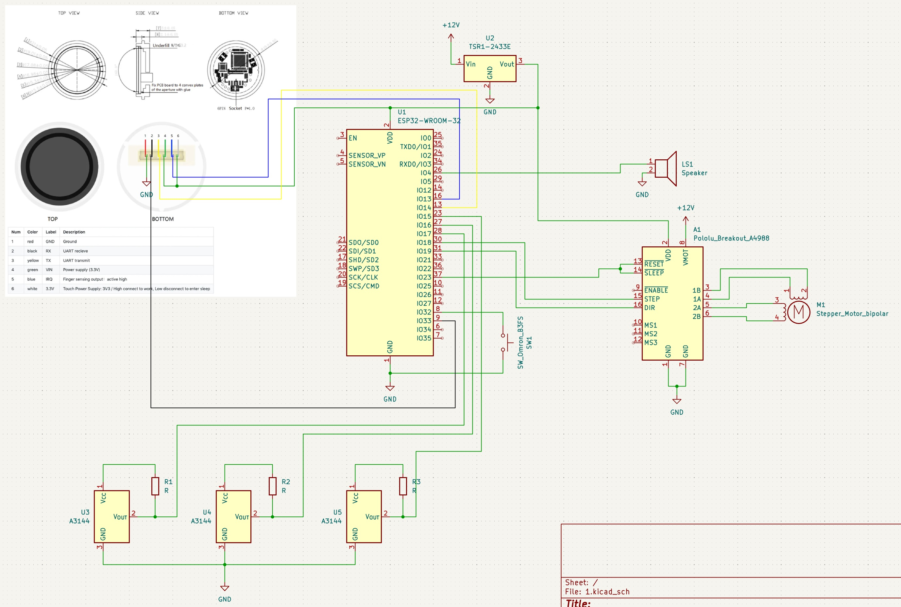

Door lock - это проект который позволяет добавить электромоторный замок Ps-Link PS-EMTL-SS-ID V2 в умный дом Home Assistant путем замены центральной платы на ESP32.

Из приятных особенностей получаем:
- Возможность использовать сканер отпечатка пальцев (или любой удобный считыватель меток, bluetooth кнопок и все что поддерживает ESPHome)
- Удаленный контроль состояния двери
- Полноценное управление замком
- Внутренняя кнопка (при желании добавив оптрон можно подключить к СКУД)

#Логика работы
- Замок замкнется только при условии закрытой двери и замкнутого состояния геркона закрытого ригеля
- Замок отроется при условии замкнутого состояния геркона открытого ригеля
- У замка нет автозакрывания или автооткрывания. При подаче питания механическое состояние замка автоматически не изменяется. В любом из состояний замок можно открыть/закрыть ключом.
- В случае ошибки будет воспроизведен двойной сигнал и установлен флаг Alarm
- В случае успешного выполнения будет воспроизведен одинарный сигнал и снят флаг Alarm

#Материалы

1. Замок Ps-Link PS-EMTL-SS-ID V2
2. MINI D1 ESP32
3. Сканер отпечатка пальца (в моем примере использован SFM-V1.7)
4. Датчик Холла A3144 (2 шт)
5. Резистор 10кОм (3шт)
6. Драйвер шагового двигателя A4988
7. DC-DC понижающий преобразователь на 3.3В (в моем случае DSN mini 360)
8. Пьезоэлектрический динамик
9. Кнопка
10. Макетная плата 30*70 мм (2шт)
11. XH2.54 разъемы мама/папа:
    1. 6 pin (3 шт)
    2. 5 pin (1 шт)
    3. 4 pin (1 шт)
    4. 4 pin (1 шт)
    5. 3 pin (1 шт)
13. PBS-40 8 pin (2 шт)
14. KF301-2P (1 шт)
15. Провода по вкусу.

#Инструкция

- Шаговый двигатель в замке используется униполярный. Его надо переделать на биполярный. Для этого необходимо открыть черную крышку и перерезать дорожку между контактами обмоток среднего (белого) провода:

    

Сам провод можно отпаять, а можно и оставить чтобы была возможность как можно проще вернуть все в завод.

- Драйвер шагового двигателя и его коннектор располагается на отдельной макетной плате:

    

Так же у двигателя используется разъем XH2.0, его необходимо заменить на XH2.54 но уже 4-х пиновый.
Провода от основной платы завел через расширенные отверстия чтобы постараться минимизировать вероятность отлома провода.
Обмотки:
| 1A 1B | Коричневы Желтый | 
| 2A 2B | Оранжевый Красный | 

- Основная плата

    

Плату крепим справа в дефолтное отверстие (его надо будет немного рассверлить до диаметра винта), а левый винт почти идеально попадает под металлизированное отверстие на макетной плате которое так же необходимо рассверлить.
Датчики Холла располагаем примерно краем к центру магнита магнита наружу. Те левый датчик Холла должен находится левее центра магнита при закрытом ригеле и своей правой гранью корпуса буквально делить магнит пополам. Тоже самое и с правым датчиком Холла, за исключением что он должен находиться справа от магнита при открытом ригеле.
Располагаем их скосами в сторону магнитов и в упор к плате. Чувствительности как раз хватает.
Распиновка датчика Холла закрытия двери (родной датчик)
| Цвет | Назначение |
| Красный | Земля |
| Черный | Сигнальный |
| Белый | +3.3В |
У него как и у мотора родной коннектор XH2.0, и его так же необходимо заменить на XH2.54 3-х пиновый.
У всех датчиков внешняя подтяжка к 3.3В через резисторы 10кОм

DC-DC понижайку лучше или купить сразу на 3.3В, или же настроить ее до монтажа на плату. Есп через USB подключать только при отключенной целиком от платы. Иначе понижайка может выйти из строя.

    

#Запуск
- Есть возможность настройки направления работы, количества шагов, максимальной скорости. В ходе испытаний выявлено что оптимальной максимальной скоростью является 350 об/с.
- В среднем на открытие/закрытие в ходе тестовых испытания вышло 37-39 шагов, по этому по умолчанию установлено 40 шагов.
- Шаговый двигатель будет отключен при срабатывании необходимого датчика Холла, или через 1 секунду работы вне зависимости от того достиг он цели или нет.
